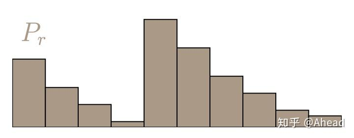
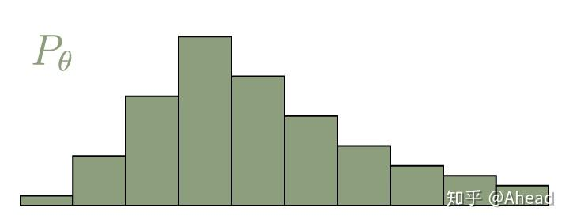
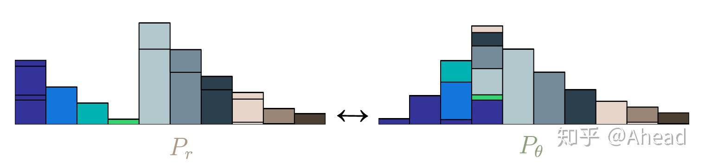
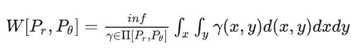
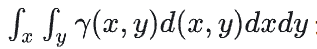
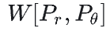
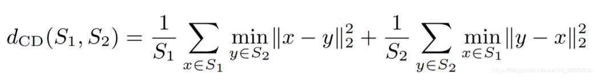

# EMD(earth mover's distance)距离

## 通俗理解

对于离散的概率分布，wasserstein距离也被描述为推土距离（EMD）。如果我们将分布想象为两个有一定存土量的土堆，那么EMD就是将
一个土堆转换为另一个土堆所需的最小总工作量。工作量的定义是单位泥土的总量乘以它移动的距离。两个离散的土堆分布记作P_r
和P_{theta}，以以下两个任意的分布为例。有很多种推土的方式，我们的目标是找到其中工作量最少的哪一种，是优化问题。

**直观理解：** 土堆P_r和P_{theta}其中的单个柱条标记为P_r(x)和p_{theta}(x)，每一个P_r(x)就是当前x位置土的存量，
p_{theta}(x)就是最终x位置要存放的土量。

如果P_r(x)>P_{theta}(x)，就要将x处多余的一部分（P_r(x)-P_{theta}(x)）土搬运到别处；

如果P_r(x)<P_{theta}(x)，就要从其他处搬运一部分到x处，使得x处的土存量为P_{theta}(x)；

## 数学定义

假设联合分布r(x,y)为联合分布，他的边缘分布为前面提到的P_r(x)和P_{theta}(x)。
.png)

P_r是原始分布、P_{theta}是目标分布。r(x,y)的含义是，要从x位置搬r(x,y)dx这么多土到y处。

从x处搬运单位土到y处的成本定义为d(x,y)，常见的成本函数一般可以有L范数衍生出来。

那么wasserstein距离就可以定义为：

inf表示下确界，即取最小，也就是说，要从所有运输方案中，找出总搬运成本  最小的方案r(x,y)，
这个方案的成本，就是我们要算的

用推土来解释就是，两个土堆形状确定（P_r和P_{theta}确定）、搬运成本d(x,y)确定，最优的搬运方案r(x,y)下的搬运成本记为
两个土堆之间的wasserstein距离。所以waesserstein距离也被成为推土机距离（earth mover's distance）。

## CD（Chamfer Distance）

## 定义
三维空间的倒角距离主要用于点云重建或三维重建工作。

公式中S1和S2分别表示两组三维点云，第一项代表S1中任意一点x到S2的最小距离之和，第二项则表示S2中任意一点y到S1的最小距离之和。
如果该距离较大，则说明两组点云区别比较大，如果距离较小，说明重建效果较好。