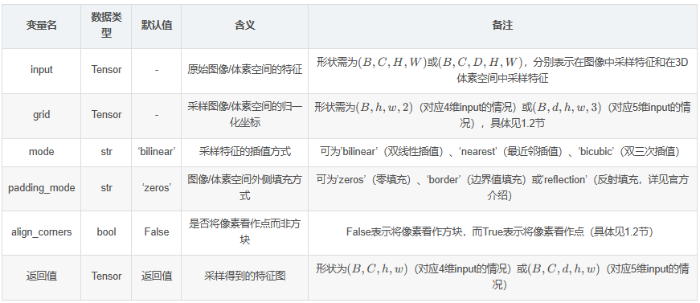
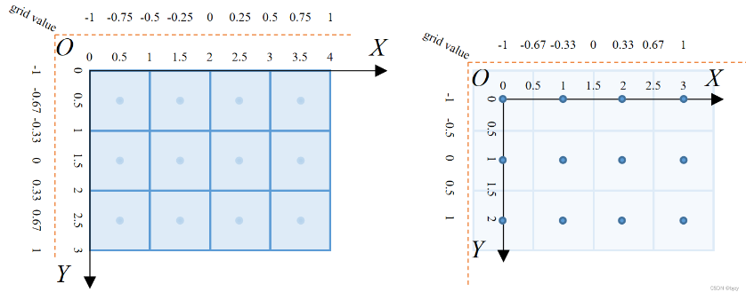
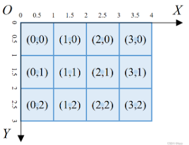

#torch.nn.functional.grid_sample（F.grid_sample）函数的说明 & 3D空间中的点向图像投影的易错点

## 1、该函数的作用
 在图像/体素空间中采样特征

## 1.1 输入和输出


## 1.2 需要注意的地方

以4维输入（即从图像采样特征）为例，设置图像大小为（H,W）。

* 当align_corner=False时，函数会将像素视为方块，并以图像左上角像素的左上角为原点建立坐标系（如下左图所示）；否则函数会将像素视为点，以图像左上角像素（中心）为原点建立坐标系（如下右图所示）。



* 参数grid的元素需主要分布在[−1,1]内，表示归一化采样坐标。其中−1表示图像范围内的最小坐标，而1表示图像范围内的最大坐标（如上图所示）。
  
* 参数grid中的最后一维的顺序为（x,y）,但输入图像大小（H,W）对应（y_size,x_size）。例子如下：

```python
import torch
from torch.nn import functional as F
a = torch.arange(12, dtype=torch.float).reshape(3,4).unsqueeze(0).unsqueeze(0)  #(1,1,3,4)
grid =torch.tensor([[[-0.25,-1.0],[1.0, -1.0]],
                    [[-1.0,1.0], [1.0,1.0]]]).unsqueeze(0)  #(1,2,2,2)

out = F.grid_sample(a, grid=grid, padding_mode='border')

# 输出a：
# tensor([[[[ 0.,  1.,  2.,  3.],
#           [ 4.,  5.,  6.,  7.],
#           [ 8.,  9., 10., 11.]]]])
# 输出out：
# tensor([[[[ 1.,  3.],
#           [ 8., 11.]]]])
# 我们只关注采样的左上角元素，坐标为(-0.25,-1.0)，对应上左图中的第一行第二个格子的顶部中心，
# 在双线性插值、边界值填充的情况下采样特征就是该像素的特征1。
```

* 对于5维输入（即从体素空间采样特征）的情况，参数grid中的最后一维顺序为（x,y,z)，但输入体素空间大小（D,H,W）对应（z_size,y_size,x_size)。例子如下：

```python
import torch
from torch.nn import functional as F
a = torch.arange(12, dtype=torch.float).reshape(3,4).unsqueeze(0).unsqueeze(0)  #(1,1,3,4)
grid = torch.tensor([[[[-0.25, -1.0, -1.0], [1.0, -1.0, -1.0]],
                      [[ -1.0,  1.0,  1.0], [1.0,  1.0,  1.0]]]]).unsqueeze(0)	# (1,1,2,2,3)
out = F.grid_sample(a, grid=grid, padding_mode='border')						# (1,1,1,2,2
# 输出a：
# tensor([[[[[ 0.,  1.,  2.,  3.],
#            [ 4.,  5.,  6.,  7.],
#            [ 8.,  9., 10., 11.]],		# 第一层
# 
#           [[12., 13., 14., 15.],
#            [16., 17., 18., 19.],
#            [20., 21., 22., 23.]]]]])	# 第二层
# 输出out：
# tensor([[[[[ 1.,  3.],
#            [20., 23.]]]]])
# 我们只关注采样的左上角元素，前两个维度的坐标为(-0.25,-1.0)，对应上左图中的第一行第二个格子的顶部中心；
# 而第三个维度的坐标为-1.0，对应最上层的最上部（自行想象3D体素空间）。在双线性插值、边界值填充的情况下，
# 采样特征就是该体素（最上层、第一行第二个体素）的特征1。
```

## 2、3D空间中的点向图像投影时的易错点

## 2.1点向图像的投影

设图像的内参矩阵（3*4）扩维为4*4后的矩阵为I，相机坐标系中的点（3维）扩维到4维后的向量维p=(x,y,z,1)^T,图像坐标系下的像素索引（可为小数）为（u,v）,深度为d,则
(ud,vd,d,1)^t = I·P

## 2.2易错点：小数索引转换为整数索引（寻找对应的像素）

下图所示为上述（u,v）被定义的坐标系及像素的整数索引。



