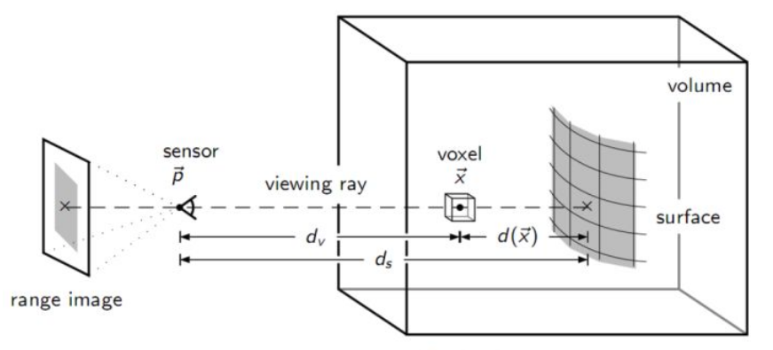
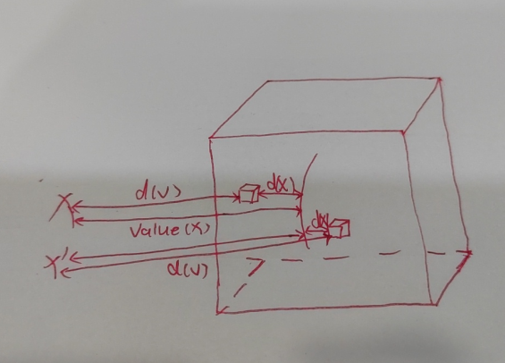
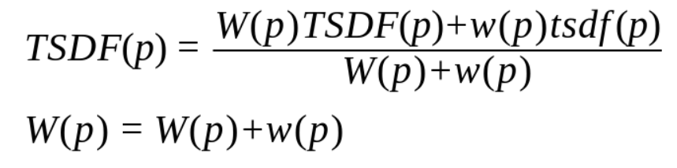

# 名词解释

`SDF` 带符号距离函数

`TSDF` 截断式带符号距离函数

上面两种是体素表示的常见方式，也是3D重建中计算隐势面的常见方法。

# 准备工作

1、建立长方体包围盒，可以完全包围需要重建的物体；

2、划分网格体素，对包围盒划分为n等份，体素的大小取决于包围盒和划分体素的数据决定（体素分辨率）；

3、对于构造的立方体中的每个小体素块g，转化g为世界坐标系下三维坐标点v(根据体素大小及体素数目决定，参考if-net)；

# SDF算法理解

如图所示： 假设mesh表面点v在相机位置的投影为x，则x到mesh表面的距离为x的深度值value(x)， 
x到v外的小立方体块的距离为d(v)，小立方体块到mesh表面的点v的距离为d(x),则
sdf(v) = value(x) - d(v);

若小立方体块在mesh外，则sdf(v)>0;若在mesh内，则sdf(v) < 0;

# TSDF算法理解

计算出某个点的sdf后，假设截断距离为u，则tsdf(v) = sdf(v) / |u|;

若sdf(v) > 0,则tsdf(v) = 1;

若sdf(v) < 0,则tsdf(v) = -1;

权重w(v) = cos(theta) / d(v) 

以上是单个点的tsdf计算方式，融合TSDF(V)的计算方式如下：

**注意**：第一个点的融合TSDF就是该点的tsdf值

