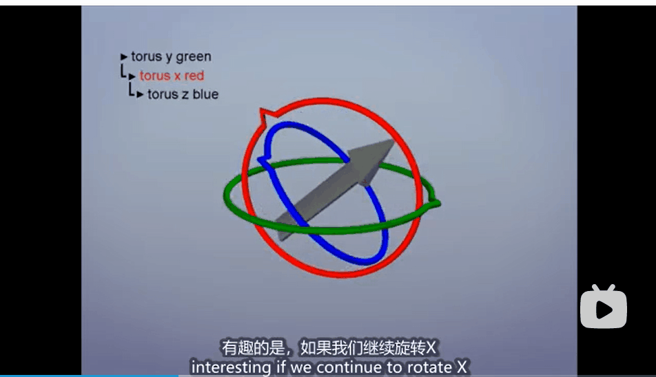

# 1. 基本概念

* aff: 4x4 仿射矩阵，用于操作形状为 (4,) 或 (4, N) 的齐次坐标；
* MAT: 3 × 3 变换矩阵，用于操作形状 (3,) 或 (3，N) 的非齐次坐标矢量。旋转矩阵是变换矩阵的一个例子
* Euler-Euler angles:给定轴旋转的三个标量序列
* axangle: 用轴（向量）和角度（标量）表示绕哪个轴旋转及旋转的角度；
* quat: 四元数，形状(4,)
* rfnorm: 由法线（向量）和可选点（向量）定义的平面中的反射；
* zfdir: 缩放由因子（标量）和方向（向量）编码；
* zdir: 因子（标量），方向（向量）对来指定3D缩放矩阵；
* striu: 由向量编码的剪切，给出NxN数组对角线上方的三角部分（用于ND变换）；
* sadn: 由角度标量、方向向量、法向量（以及可选的点向量）编码的剪切变换;

# 2. 安装脚本

```
pip install transforms3d
```
# 使用约定
* 变换矩阵应用于左边，坐标（列向量）向量应用于右边

# 缺陷
[参考](http://en.wikipedia.org/wiki/Gimbal_lock)

欧拉角存在一个主要缺陷，即在某些旋转序列中，可能会出现三个欧拉角中的两个角导致物体绕同一轴旋转的情况。在下面的情况下，绕轴的旋转效果与绕轴的旋转效果变得无法区分，因此和轴的角度合并为一个变换，旋转从三个自由度减少到两个𝑥𝑧𝑧𝑥。

当任何一个坐标轴旋转角度为90度时，就会有两个轴的旋转动作起到对总体旋转结果相同的效果，这就被称为“死锁“，动态图如下所示：



