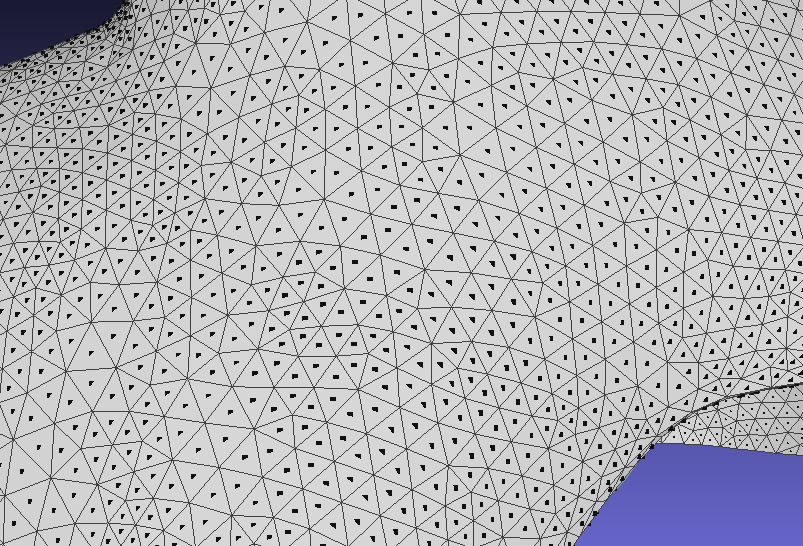

## <font face="微软雅黑" color=green size=5>文件IO与save</font>


### <font face="微软雅黑" color=green size=5>open3d </font>
```python
mesh_path = 'test_gum.ply'
import numpy as np
import open3d as o3d
mesh = o3d.io.read_triangle_mesh(mesh_path)
mesh.compute_vertex_normals()  # 计算顶点法向量
mesh.paint_uniform_color([0.7, 0.7, 0.7])  # 设置mesh颜色
vertices = np.asarray(mesh.vertices)  # 顶点
faces = np.asarray(mesh.triangles)  # 面片索引

# 已知顶点和面片，组成mesh
mesh1 = o3d.geometry.TriangleMesh()
mesh1.vertices = o3d.utility.Vector3dVector(vertices)
mesh1.triangles = o3d.utility.Vector3iVector(faces)

# 计算轴对齐包围盒, 获取最大最小边界
bounds = mesh.get_axis_aligned_bounding_box()
min_bound = bounds.get_min_bound()
max_bound = bounds.get_max_bound()
# 创建轴对齐包围盒
box = o3d.geometry.AxisAlignedBoundingBox(min_bound, max_bound)

# 获取mesh中心
center = box.get_center()

# 将mesh平移到世界坐标中心
box = box.translate(-center)

# 利用box裁剪mesh
clipped_mesh = mesh.crop(box)

# 可视化mesh 
o3d.visualization.draw_geometries([mesh, mesh1, clipped_mesh, box])

# 输出mesh
o3d.io.write_triangle_mesh('test_gum.ply', mesh)
```

### <font face="微软雅黑" color=green size=5>trimesh</font>

```python
import trimesh
import numpy as np
mesh_path = 'test_gum.ply'
mesh = trimesh.load(mesh_path)
vertices = mesh.vertices  # 顶点
faces = mesh.faces # 面片索引

# 已知顶点和面片，组成mesh
mesh1 = trimesh.Trimesh(vertices, faces)

# 计算轴对齐包围盒, 获取最大最小边界
bounds = mesh.bounds()

# 获取mesh中心
center = mesh.bounding_box.centroid

# 将mesh平移到世界坐标中心
mesh.apply_translation(-center)

# 创建包围盒
extents, t = trimesh.bounds.to_extents(
                [np.array([bounds[0][0] - 9, bounds[0][1] - 9, bounds[0][2]]),
                 np.array([bounds[1][0] + 9, bounds[1][1] + 9, bounds[1][2] + 5])])

box = trimesh.creation.box(extents=extents, transform=t)
# 利用box裁剪mesh
clipped_mesh = mesh.slice_plane(box.facets_origin, -box.facets_normal)

# 可视化mesh
trimesh.Scene([mesh, mesh1, box, clipped_mesh]).show()
```

### <font face="微软雅黑" color=green size=5>vedo</font>

```python
import vedo
mesh_path = 'test_gum.ply'
mesh = vedo.load(mesh_path)
vertices = mesh.points()  # 顶点
faces = mesh.faces() # 面片索引

# 已知顶点和面片，组成mesh
mesh1 = vedo.Mesh([vertices, faces])

# 可视化mesh
vp = vedo.Plotter(N=2)
vp.at(0).show([mesh])
vp.at(1).show([mesh1])
vp.interactive().close()

# vedo 体素化
import numpy as np
from vedo import show
data_matrix = np.zeros([10, 10, 10], dtype=np.uint8)
data_matrix[:3, :3, :3] = 1
data_matrix[3:7, 3:7, 3:7] = 8
data_matrix[7:10, 7:10, 7:10] = 15

vol = vedo.Volume(data_matrix).legosurface(vmin=1, vmax=15, boundary=True)
# vol.cmap(['white', 'b', 'g', 'r']).mode(1)
vol.add_scalarbar()
show(vol).close()

```

### <font face="微软雅黑" color="red" size=5>计算每个面片的中心点（质心）


```python
import vedo 
mesh = vedo.load(r"path")
# 计算每个面片的质心
m_cell_center = mesh.cell_centers   # 效果如上图所示
# 转换成点云格式
pcd = vedo.Points(m_cell_center)
```
## <font face="微软雅黑" color=green size=5>trimesh&open3d采样</font>

```
# trimesh
mesh_co_pcd = inputs.sample(pcd_samples_num)  
# open3d
mesh_co_pcd = inputs.sample_points_uniformly(number_of_points=pcd_samples_num)
mesh_co_pcd = np.asarray(mesh_co_pcd.points)
```

## <font face="微软雅黑" color=green size=5>颜色映射</font>
```python
import trimesh 
mesh = trimesh.load(r"path")
label =[1, 1, 2, 3, 4]  # 网格面片的标签
colormap_hex = ['#e6194B', '#3cb44b', '#ffe119', '#4363d8']  # 十六进制颜色
colormap = [trimesh.visual.color.hex_to_rgba(i) for i in colormap_hex]
colors = [colormap[int(label[i])] for i in range(len(label))]
mesh = trimesh.Trimesh(vertices=mesh.points, faces=mesh.faces, face_colors=colors)

```