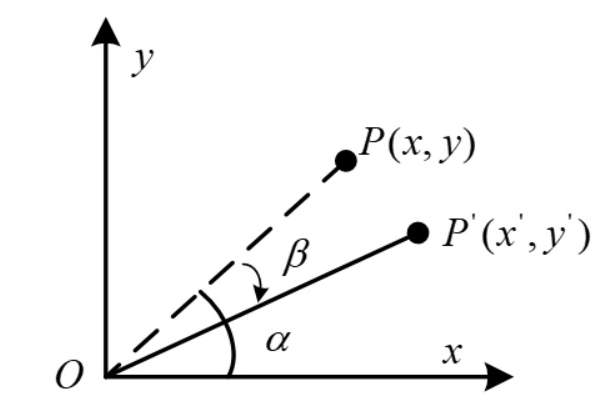

### 理解

旋转矩阵的旋转包含两种含义：

1、在同一坐标系下，***向量的旋转*** ；
 
2、同意向量在不同坐标系下有不同的坐标，***坐标系旋转*** ；

### 向量旋转

#### 平面二维旋转

根据三角函数关系，可以列出向量OP与OP'的坐标表示形式：

对比上面个两个式子，将第2个式子展开：

用矩阵形式重新表示为：

这就是二位旋转的基本形式，中间的矩阵即二维旋转的***旋转矩阵***，坐标中的某一向量左乘该矩阵后，即得到这个向量
旋转β角后的坐标。

####三维旋转（绕谁谁不变）

三维旋转可借助二维旋转来理解，由于三维空间中可以任意轴旋转，为方便分析与使用，只考虑绕X,Y,Z轴的旋转。

* 绕 Z 轴

参照上面的图，添加一个Z轴，则上面的三维旋转实际上就是绕Z轴的三维旋转

照搬上面的推导公式，并添加Z坐标的变换关系(实际是没有变)，然后改写成矩阵形式，红色方框即为绕Z轴的旋转矩阵。

* 绕 Y 轴

绕Y轴旋转同理，这里直接改变坐标轴的符号表示，**注意坐标顺序要符合右手系**，我这里用颜色区分了不同的轴。
最终的矩阵形式要进一步改写成XYZ的顺序。红色方框即为绕Y轴的旋转矩阵。

* 绕 X 轴

参照绕Y轴的推导，可以得到绕X轴的结果。红色方框即为绕X轴的旋转矩阵。

* 助记

对于单位矩阵，绕哪个轴旋转，哪一列不用变，然后将二维旋转矩阵替换对应的4个位置，
注意，绕Y的旋转矩阵看起来与另外两个不同，它的-sinβ是在左下！

* 注意事项

  * 反向旋转
    
    如果是反向旋转一个角度，推理过程类似：
    
    
    
    最终得到的旋转矩阵其实是正向旋转矩阵的逆矩阵，由于这个矩阵是正交矩阵，所以逆矩阵就是转置矩阵
    
    

  * 书写形式

    上面的向量的坐标都是按照列的形式书写，如果是换成行的形式表示，则旋转的矩阵形式被转置了以下，
    同时矩阵在行向量的右边进行相乘。
    
    

[原文](https://zhuanlan.zhihu.com/p/183973440)
