# 1、曲面重建的目标、方法分类

在曲面重建领域，大部分的研究始于上世纪就是年代，而自2012年深度学习兴起之后，出现了大量
关于如何将已有技术以深度学习的形式重现的研究，通常都能在原本的基础上取得一定程度的性能提高。
本节介绍传统方法，而引入深度学习后的相关技术会在本系列的第三部分介绍。

曲面重建的目标是从配准后的点云重建出水密（watertight）的三维模型，最好是网格模型；

* 扫描得到的点云数据只是一种基本的、对物理目标的理解形式，一般无法直接使用，还不能称之为模型；

* 经重建得到的三维模型可以方便的应用于各个场景，例如医疗。

从点云重建网格模型的关键是冲离散点构建出拓扑连接关系，常见的算法分为两种：

* 基于计算几何学的显示方法（explicit）：

  通常认为输入点云中的每个点都是重构网格的顶点，计算输入点云的德洛奈三角网（Delaunay triangulation network）
或其对偶的沃洛诺伊图（Voronoi diagram）,然后利用这些图结构构造出点云中点的连接关系；

  * 可以最大程度的保持重建网格和输入点云几何特性的一致性；

  * 非常依赖于输入的质量，对于含噪声的点云需要去噪之后再重构；

* 基于隐式曲面的隐式方法（implicit）

  认为输入点云是三维空间在隐式函数零水平集（zero level set）的采样，首先根据点云位置
拟合出光滑的隐式函数，然后构造轮廓面，将隐式函数的零水平集离散化为三角网格；
  
  * 主流，和显示方式相比较更高效一些，对于输入噪声也更稳定一些；
    
  * 可以确保是流形（manifold），这里可以简单地理解为输出网格中的三角面片的每条边，除了边界，都连接了两个面；
    
  * 不能控制输出三角面片的形状，可能有大量狭长的三角面片，需要重网格化，让面片的形状更规则；
    
这些方法都要求输入的点云是稠密的，基本覆盖了物理对象。如果只能覆盖一部分，一般使用深度学习这样的数据驱动的方式，引入先验（prior）知识。

本节关注于隐式方法。

## 1.1*补充：流形（manifold）的概念

地面看起来是平坦的，但是如果从太空看去，可以发现地球表面更像是球面。一般地说，一个d维流形是一个“局部”和d维欧几里得空间一样的几何对象。

* 流形是曲线和曲面概念的推广；

更严谨地说，流形（manifold）是一类拓扑空间，它在每一点的附近都与欧氏空间同胚（拓扑等价）；
n维流形是一种连通的拓扑空间，其中每点有一个邻域与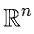或（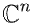）同胚。

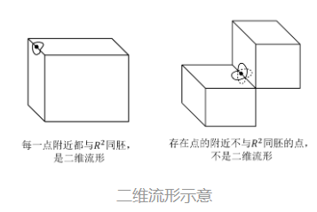

一些数学概念的定义：

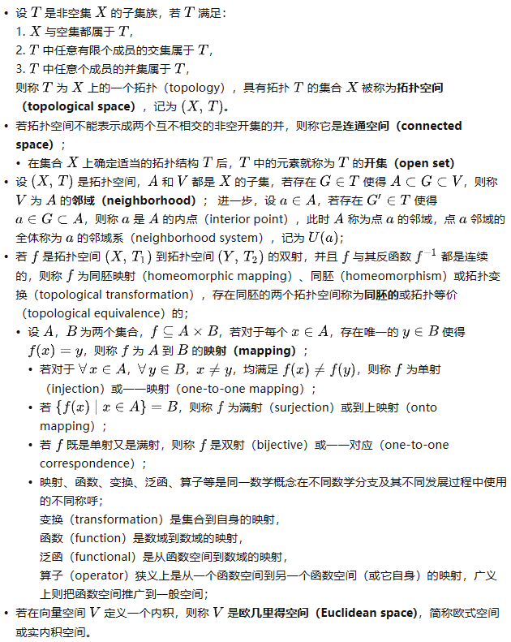

# 2、隐式方法从无组织的点云重建曲面

1992年，Hoppe等人发表论文《Surface Reconstruction from Unorganized Points》，建立了隐式方法重建曲面的框架。

输入点云数据的采样密度 $\rho$ ,噪声量级 $\sigma$ ,该方法重建网格模型的过程可粗略的分为两个阶段：

1、从点云构建由隐函数定义的隐式曲面；

2、从隐函数零水平集抽取等值面，重建网格模型；

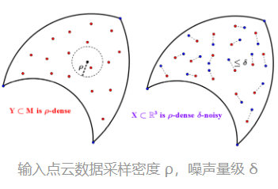

## 2.1从点云构建隐式曲面

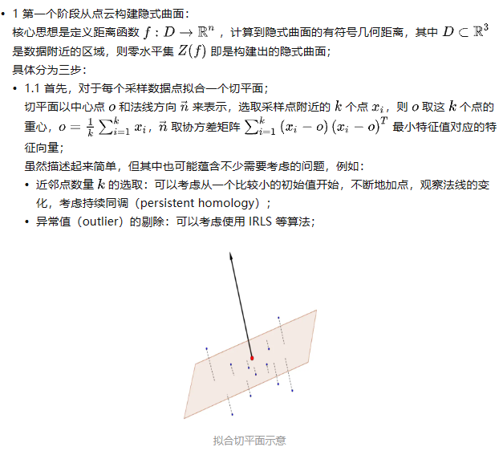

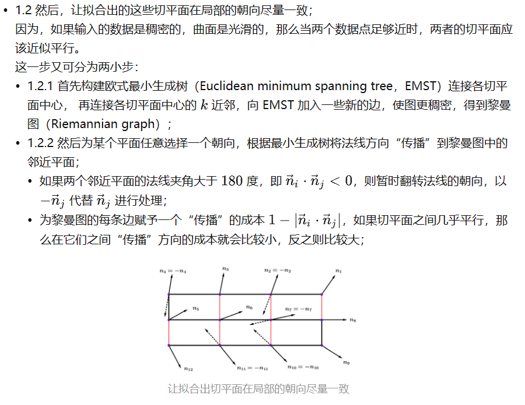

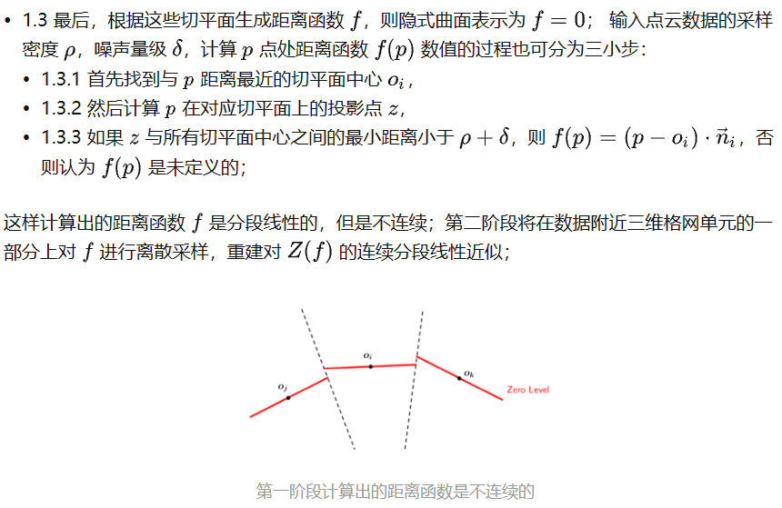

## 2.2Marching Cubes算法抽取等值面，重建网格模型

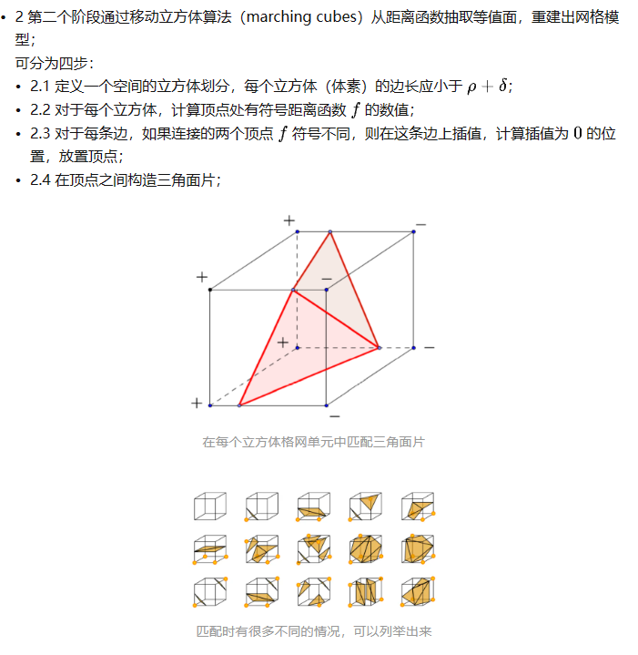

## 2.3分析

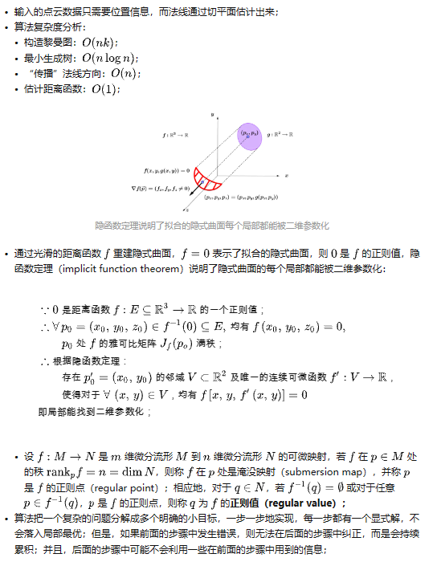

# 3、从点云构建隐式曲面方法的发展

## 3.1VRIP算法

1996年，Curless 和 Levoy 发表论文《A Volumetric Method for Building Complex Models from Range Images》，提出了 VRIP 算法（volumetric range image processing）。

算法的核心思想是在计算隐式曲面时，附上获取深度信息时传感器的位置，作为可见性约束，使拟合效果更好。
过程可分为三步：

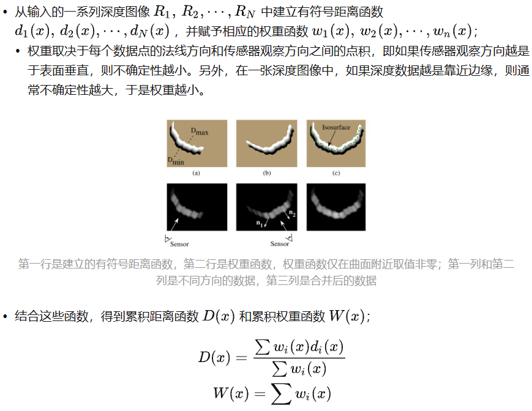

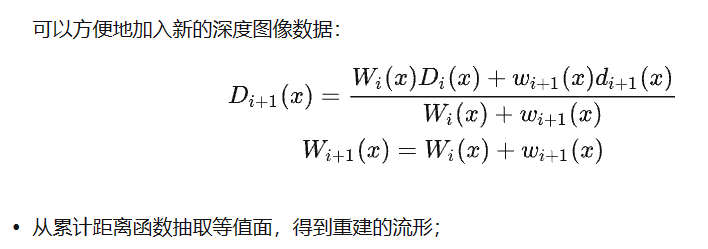

## 3.2基于径向基函数的隐式曲面（RBF）

使用基于径向基函数（radial basis function，RBF）的隐式曲面重建曲面模型，算法的核心是从点云重建隐式曲面时，不再通过拟合切平面来计算有符号距离函数f，而是认为
f是一系列径向基函数的加权和。

* 从某个函数空间中选择基函数，通过求解由输入点定义的线性方程组，得到基函数的权重向量，以线性组合的方式计算f的数值；

*当完成这个代价较大的预计算步骤后，在任何一点都可以简单地估计函数值；

*输入的点云数据需要指明表面地朝向；

算法的具体过程如下：

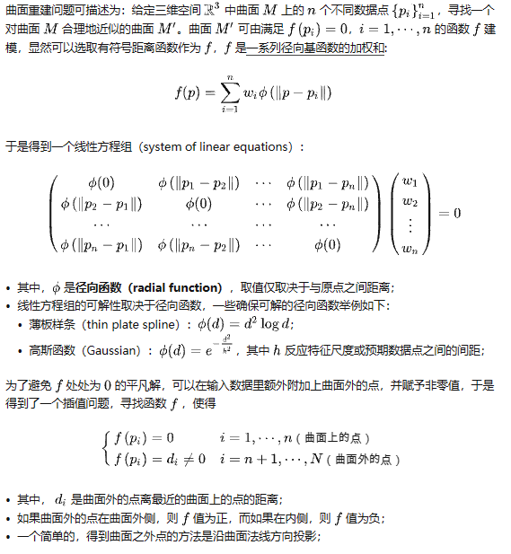

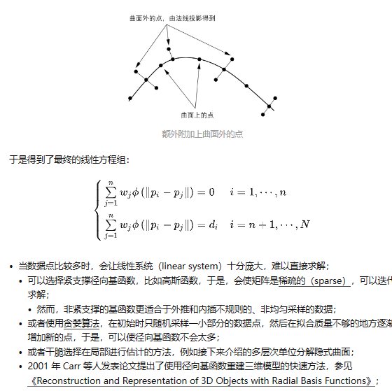

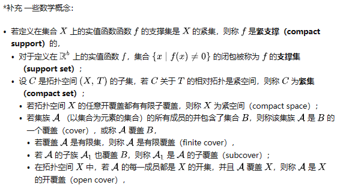

## 3.3多层次单位分解隐式曲面（MPU）

使用多层次单位分解（multi-level partition of unity，MPU）隐式曲面重建曲面模型，算法的核心也是从点云重建隐式曲面时距离函数的计算。

* 输入数据点需要附有法线，指明表面的朝向；

* 多层次单位分解隐式曲面在构建距离函数时，先拟合各个局部的曲面片，再拼接一起，得到最终的距离函数；

*基于径向基函数的隐式曲面在构建时， 直接求解全局的拟合；

算法核心步骤如下：

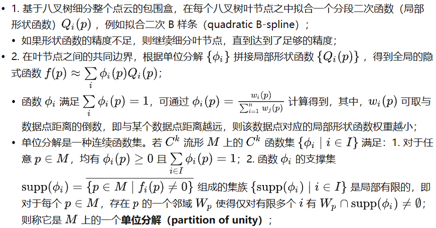

## 3.4基于投影的方法（Projection-base Approaches）

基于径向基函数，或者多层次单位分解迭代地拟合隐式曲面，实际上都可以视为是使用移动最小二乘（moving least squares，MLS）方法（即局部加权的最小二乘）拟合曲面片，而这个拟合的过程可看作把局部的数据点投影（project）到一个参考面；

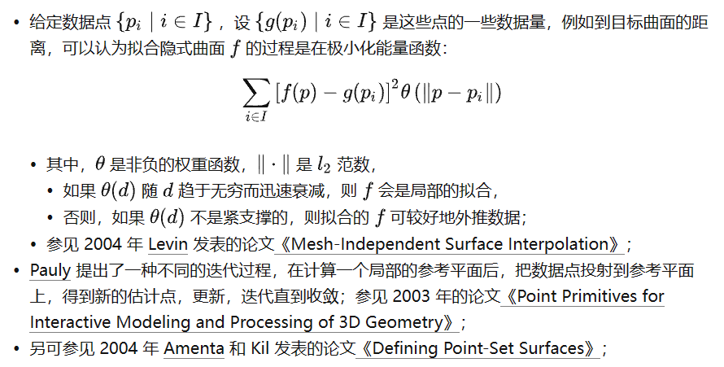

## 3.5泊松曲面重建

2006 年 Kazhdan 等人提出了泊松曲面重建算法，通过求解泊松方程来拟合隐式曲面。

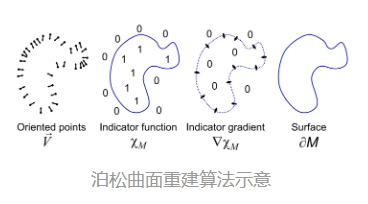

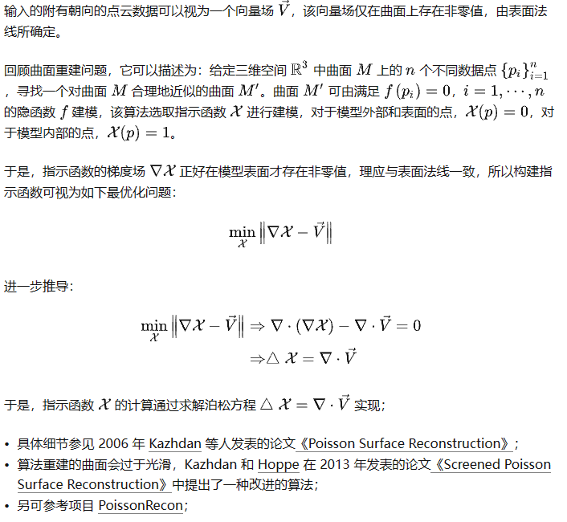

# 4、抽取等值面重建网格模型的其他方法

## 4.1Dual Contouring算法

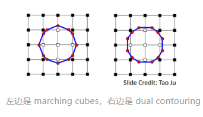

除了前文提到的移动立方体算法（marching cubes）之外，还有其对偶方法—— dual contouring 算法；

* marching cubes 算法在空间格网单元的边放置网格模型的顶点；
* dual contouring 算法在空间格网单元内部放置网格模型的顶点；
  * 根据有符号距离函数f,在每个空间格网单元的每条边上线性插值，计算f=0的位置，然后连接这些位置，在连线的质心（centroid）放置顶点；
  * 对于相邻网格立方体中的四个顶点，创建一个四边形连接（或两个三角形连接）；

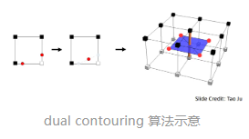

* dual contouring 算法生成的顶点和四边形对应于 marching cubes 算法生成的，未三角化的多边形和顶点；

* 对于marching cubes 算法，
  * 生成的网格模型总是流形，
  
  * 但需要查找表（look-up table），通常生成的多边形比较狭小，且依赖于均匀的空间格网单元；
    
* 对于 dual contouring 算法，
  
  * 不需要查找表，生成多边形的形状更好、更规则，依赖的空间格网单元可以是任意类型，
  
  * 但生成的网格模型可能不是流形；

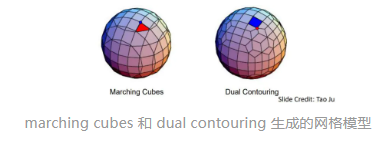

# 本节的录播视频

[学习视频](https://www.bilibili.com/video/BV1pw411d7aS/?p=3)

[原博客链接](https://zhuanlan.zhihu.com/p/464675628)