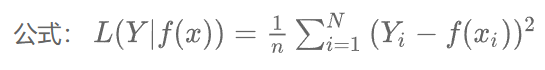
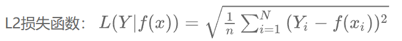
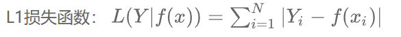
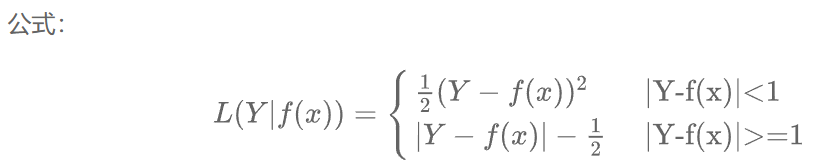
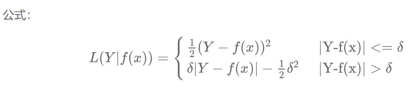
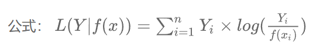
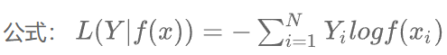
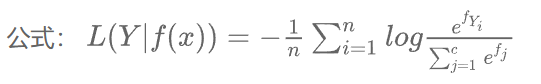
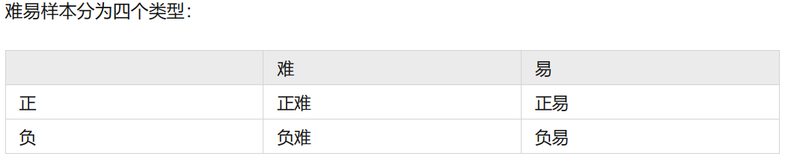

# 损失函数

定义：损失函数就是来度量模型的预测值与真实值的差异程度的运算函数，损失函数越小，模型的鲁棒性就越好。

作用：损失函数主要使用在模型训练阶段，每个批次的训练数据送入模型后，通过前向传播输出预测值，然后损失函数会计算出预测值和真实值之间的差异，也就是损失值。得到损失值之后，模型通过反向传播去更新哥哥参数，来降低真实值与预测值之间的损失，使得模型生成的预测值往真实值方向靠拢，从而达到学习的目的

## 基于距离度量的损失函数

通常将输入数据映射到基于距离度量的特征空间上，如欧式空间、汉明空间等，将映射后的样本看作空间上的点，采用合适的损失函数度量特征空间上样本真实值和模型预测值之间的距离。特征空间上两个点的距离越小，模型预测性能越好

### 均方误差损失函数(MSE)

在回归问题中，均方误差损失函数用于度量样本点到回归曲线的距离，通过最小化平方损失样本点可以更好的拟合回归曲线。均方误差损失函数的值越小，表示预测模型描述的样本数据具有越好的精确度。

优点：无参数，计算成本低，具有明确的物理意义

缺点：MSE在图像和语音处理方面表现较弱

MSE是评价信号质量的标准，在回归问题中常被用作模型的经验损失或算法的性能指标。

### L2范数损失函数

L2损失又被称为欧式距离，是一种常用的距离度量方法，常用于度量数据点之间的相似度。由于L2损失具有凸性和可微性，且在独立、同分布的高斯噪声的情况下，它能够提供最大的似然估计，使它成为回归问题、模式识别、图像处理中最常用的损失函数。

### L1范数损失函数

L1损失又称曼哈顿距离，表示残差的绝对值之和。

优点：L1损失对离群点有很好的鲁棒性。

缺点：在残差为0处不可导；更新的梯度始终相同，也就是说，即使很小的损失值，梯度也很大，不利于模型的收敛，针对他的收敛问题，一般的解决办法是在优化算法中使用变化的学习率，在损失接近最小值时降低学习率。

### Smooth L1损失函数

SmoothL1损失是由Grishick R在Fast R-CNN中提出的，主要用在目标检测中防止梯度爆炸。

### Huber损失

Huber是平方损失和绝对损失的综合，它克服了平方损失和绝对损失的缺点，不仅使损失函数具有连续的导数，而且利用MSE梯度随误差减小的特性，可取得更精确的最小值。

优点：对于异常点有更好的鲁棒性

缺点：引入了额外得参数，选择合适的参数比较困难，增加了训练和调试得工作量。

## 基于概率分布的损失度量

基于概率分布度量得损失函数是将样本间得相似性转化为随机事件出现的可能性，即通过度量样本的真实分布于它估计得分布之间的距离，判断两者得相似度，一般用于设计概率分布或预测类别出现概率得应用问题中，常用在分类问题中

### KL散度函数（相对熵）

KL散度也被称作相对熵，是一种非对称度量方法，常用于度量两个概率分布之间的距离。KL散度也可以衡量两个随机分布之间得距离，两个随机分布得的相似度越高，他们的KL散度越小，因此KL散度可以用于比较文本标签或图像的相似性。 基于KL散度的演化损失函数有JS散度损失函数，也称作JS距离，用于衡量两个概率分布之间的相似度，它是基于KL散度的一种变形，消除了KL散度非对称的问题，与KL散度相比，它使得相似度判别更加准确。
相对熵恒大于等于0，当且仅当量分布相同时，相对熵等于0.

### 交叉熵损失

交叉熵是信息论中的一个概念，最初用于估算平均编码长度，引入机器学习后，用于评估当前训练得到的概率分布与真实分布的差异情况。为了使神经网络的每一层输出从线性组合转为非线性毕竟，以提高模型的预测精度，在以交叉熵为损失函数的神经网络模型中一般选用tanh、sigmoid、softmax或Relu作为激活函数。

交叉熵损失函数刻画了实际输出概率与期望输出概率之间的相似度，交叉熵的值越小，两个概率分布越接近，特别是在正负样本不均衡的分类问题中，常用交叉熵做损失函数。目前，交叉熵损失函数是卷积神经网络中最常使用的分类损失函数，它可以有效避免梯度消散。在二分类情况下也叫做对数损失函数。

.png)

### Softmax损失函数

从标准形式上看，softmax损失函数应归到对数损失的范畴，在监督学习中，它被广泛使用。Softmax函数本质上是逻辑回归模型在多分类任务上的一种延伸，常用作CNN模型的损失函数。Softmax损失函数的本质是将一个K维的任意实数向量x映射成另一个k维的实数向量，其中，输出向量中的每个元素的取值范围都是（0，1），即softmax损失函数输出每个类别的预测概率。常用于分类、分割、人脸识别、图像自动标注和人脸验证。

Softmax函数具有类间可分性，再多分类和图像标注问题中，常用它解决特征分离问题。在基于卷积神经网络的分类问题中，一般使用softmax损失函数作为损失函数，但他学习到的特征不具有足够的区分性，因此常与对比损失或中心损失组合使用，以增强区分能力。

### Focal损失

该损失主要为了解决难易样本不均衡的问题

易分类样本虽然损失很低，但是数量多，对模型效果提升的贡献小，模型应重点关注难分样本，因此需要把置信度高的损失再降低一些

.png)

### 感知损失

将真实图片经过CNN得到的特征与生成图片经过CNN得到的特征作比较，使得高层信息（内容和全局结构）接近。

《Perceptual Losses for Real-Time Style Transfer and Super-Resolution》

优点：风格转移或者超分辨率中，速度快，GAN中收敛效果好，具有高频细节信息

为什么收敛速度快？
回传导数时，相比于MSE对pixel与pixel之间的差异， 回传分布更具有普适性

## 如何选择损失函数
（1） 选择最能表达数据的主要特征来构建基于距离或基于概率分布度量的特征空间。

（2）选择合理的特征归一化方法，使特征向量转换后仍能保持原来数据的核心内容。

（3）选取合理的损失函数，在实验的基础上，依据损失不断调整模型的参数，使其尽可能实现类别区分。

（4）合理组合不同的损失函数，发挥每个损失函数的优点，使它们能更好地度量样本间的相似性。

（5）将数据的主要特征嵌入损失函数，提升基于特定任务的模型预测精确度
