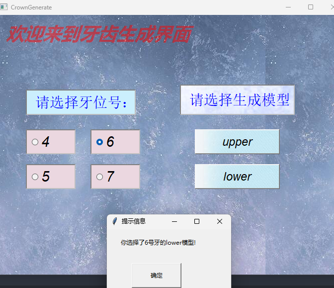
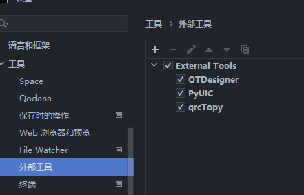
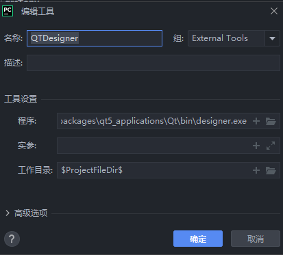
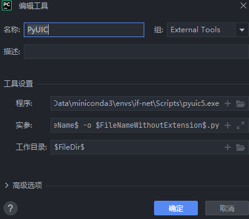
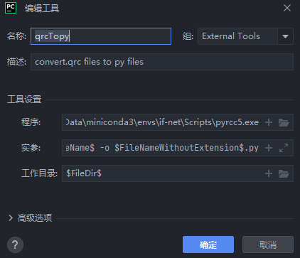

## 注意事项
* 注意：ui界面文件是个对话框，那么MyApp就必须继承 QDialog

* 类似的，若ui界面文件是个MainWindow，那么MyApp就必须继承 QMainWindow

* 加载背景图片的重要依据，首先把.qrc文件转成py文件，然后导包调用

* 在类中调用类里面的函数可以像调用其他类一样，如self.main()直接调用即可

## 在pycharm中需要加载以下三个外部工具

