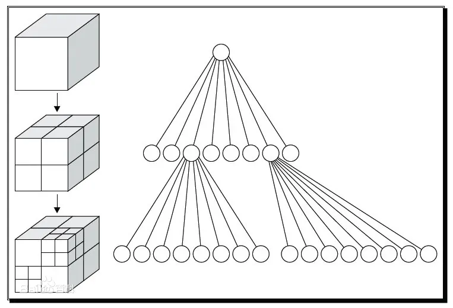

### 定义

用于描述空间的树状结构

八叉树（OCtree）：若不为空树的话，树中任一节点的子节点恰好只会有8个或0个。

八叉树的每个节点表示一个正方体的体积元素，每个节点有八个子节点，将八个子节点所表示的体积元素加在一起就等于父节点的体积。

### 实现原理

（1 设定最大递归深度

（2 找出场景中的最大尺寸，并以此尺寸建立第一个立方体

（3 依序将单位元元素丢入能被包含且没有子节点的立方体

（4 若没有达到最大的递归深度，就进行细分八等份，再将该立方体所装的单位元元素全部分担给八个子立方体

（5 若发现子立方体所分配到的单位元元素数量不为0且跟父立方体是一样的，则该子立方体停止细分，因为根据**空间分割理论**，细分的空间
所得到的分配必定较少，若数目一样，则再怎么切数目还是一样，会造成无穷切割的情形

（6 重复 （3 ，直到达到最大深度

注：空间分隔理论：将空间分割为两个或者多个互不相交的子空间的方法
