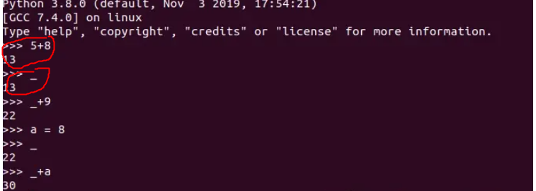
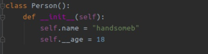
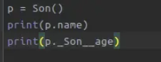
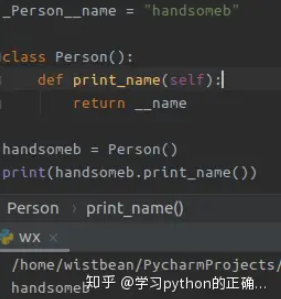

`_`:_会指向最后一次执行的表达式

`__xx__`:以两个下划线开头和结尾的命名方式，叫它们为 “魔法函数”，它是 Python 内置好了的，
        我们可以直接拿来使用。所以你应该尽量避免做这样类似的以两个下划线开头和结尾的方式去命名

`_xx`:以单个下划线开头命名的方法或者变量，就是说明它是仅提供内部使用的

`xx_`:Python 有许多关键词，比如 def、return、calss、pass 这些，它们都是有特殊的意义的，所以我们在定义变量或者方法的时候，
     不可以用它们来命名的,那么如果我们死都要这样定义名称呢？为了区分，在它们的后面添加一个下划线

`__xx`:两个下划线开头的命名,更多的是用在类的继承，通过两个下划线开头命名的成员，可以防止被子类重写

`一个下划线+类名+两个下划线开头的命名： _classname__xx`:

