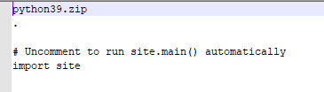

嵌入式 python 是一个简化版的 python,这个版本的 python 省去了很多无用的东西，最终只留下一个非常精简的解释器，让其他电脑可以不用安装 python 也能执行 python ,这就是嵌入式的概念

你可以理解为完整的 python 是食堂，你需要各种等待才能拿到需要的东西， python 嵌入式更像是快餐，你没办法在 python 嵌入式里面开发(大部分情况下),但是好在能够打开就用

因为嵌入式需要一串启动咒语，所以我们一般是用 .bat 的方式来进行调用，方便新手能够一键启动，目前很火的 Ai 整合包也是采用同样的方法 

## 可在python官网中下载python嵌入式包 
[下载链接](https://www.python.org/downloads/windows/)
## 重要文件说明
下载解压后里面有多个文件，其中有一些文件是不必要的，可以删掉，一共有三个文件可以保证python程序正常运行，如下图所示：

* python38.dll是Python 3.8版本的动态链接库文件，主要用于提供Python解释器的功能。
当你运行一个使用Python 3.8编写的程序时，系统会加载python38.dll来执行Python代码，
包括解释和执行Python脚本、调用标准库函数等。这个动态链接库文件是Python程序运行所必需的
组件之一。
* python38.zip是Python 3.8版本的压缩包文件，里面包含了Python标准库的源代码文件。
这个压缩包通常用于Python的发布版本中，可以方便地将标准库文件进行打包和分发。
当Python解释器在启动时，会首先检查是否存在python38.zip文件，如果存在则会将其中的标准库文件
解压缩到内存中，以加快标准库的导入速度。这个机制可以节省磁盘空间，并提高Python程序的性能。
* python.exe是Python解释器的可执行文件，用于执行Python程序。当你在命令行中输入python命令
时，系统会调用python.exe来解释和执行Python代码。通过python.exe，你可以在命令行或终端中
直接运行Python脚本文件，或者使用交互式解释器来逐行执行Python代码。python.exe是Python
编程语言的核心组件之一，它负责解释和执行Python代码，提供了Python程序的运行环境。

## 环境配置流程

### 下载嵌入式包

[参考教程](https://blog.csdn.net/m0_52475295/article/details/127411707)

* 首先我们打开官网来到最新的官网页面[python 官网](https://www.python.org/)

* 选择 Downloads 标签页，然后选择 Windows,点击

* 在屏幕中寻找带 embeddable 字眼的安装包,版本不受限制，不过最好和本地现有的安装版本一致

### 解压并配置嵌入式设置

* 我们现在把刚刚下载的文件解压到一个地方
* 下载 get-pip.py---我们发现这个版本的 python 没有 lib,我们需要自行下载，下载的方式也很简单，前往[get-pip.py](https://bootstrap.pypa.io/get-pip.py),然后将所有内容拷贝下来，保存到同名的文件中。

* 执行 get-pip.py，我们拷贝完成之后选择退出，然后在标题栏输入 cmd

* 在新打开的命令中输入 python get-pip.py
* 此时我们的目录中多出两个文件夹Lib和Scripts,我们后面会经常用到的只有 Lib 文件夹,我们在这里拷贝第三方的库
* 修改配置文件，我们现在打开python39._pth,使用记事本或者notepad++

* 去掉最后一行的注释，变成下图

## 安装新包
切换到我们的 Scripts 文件夹里面，里面应该有一个 pip.exe 文件，这个时候在导航栏里面输入 cmd 打开控制台，然后正常的 pip 即可，
最终文件会被安装到当前嵌入式环境的 Lib\site-packages 中

