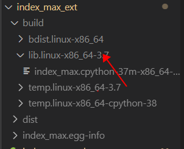

### <font face="微软雅黑" color=green size=5>同一个项目下不同文件夹导包失败的问题</font>

```print(sys.path) ```

检查系统路径是否包含项目文件的根目录（一般出现这种错是不包含的）

解决方法：

1.用`sys.path.append('path')`讲文件目录直接加载进去

2. 用`export path` 导入路径

### <font face="微软雅黑" color=green size=5>编译c++库导包失败的问题</font>

找到编译成功的库，将lib的路径添加到系统路径中


```
import sys
sys.path.append('index_max_ext/build/lib.linux-x86_64-3.7')
import index_max
```
### <font face="微软雅黑" color=green size=5>路径分割问题</font>
```
os.path.splitext(“文件路径”)    
分离文件名与扩展名；默认返回(fname,fextension)元组，可做分片操作
```

