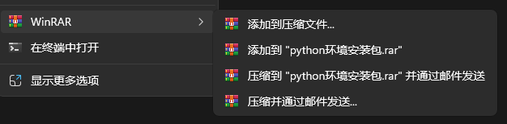
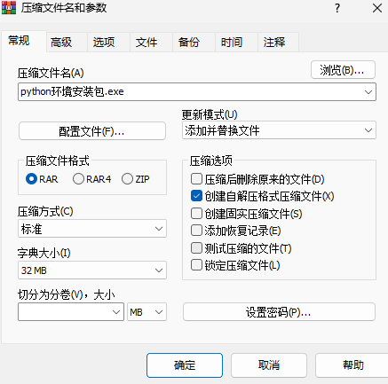
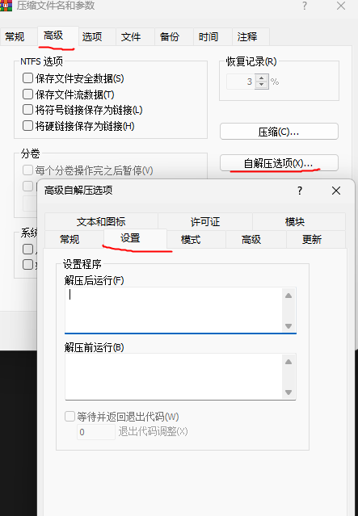
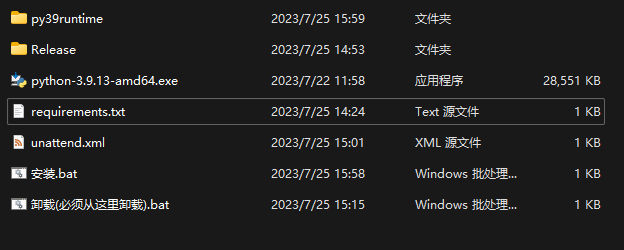

### 封装自己的代码及环境

* .bat文件

新建test.bat文件，右键*编辑*，输入并修改以下代码

```python
@echo off  
cd /d %~dp0
start lib/python.exe   ./main.py
pause
exit
```

* 将文件封装成.exe文件



如果想要解压的时候运行某个子文件，可以如下设置：


* `python环境安装包.exe`可直接双击安装解压



* 将python环境写到requirements.txt文件中，双击`安装.bat`即可一键安装相关环境依赖；`Release`文件中是相关的依赖和对应的python代码。