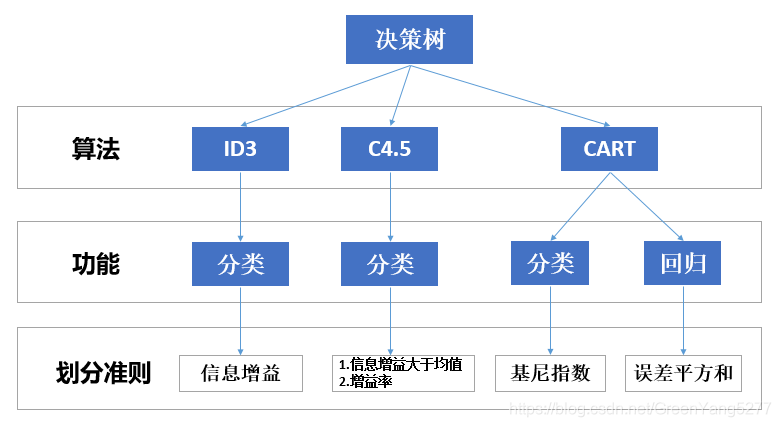

## 基本算法原理
### 决策树基本流程图

### 算法步骤

* 首先从开始位置，将所有数据划分到一个节点，称为根节点
* 然后经历橙色的两个步骤，橙色的表示判断条件：
  
  * 若数据为空集，跳出循环。如果该节点是根节点，返回null；
  * 如果该节点是中间节点，将该节点标记为训练数据中类别最多的类
  * 若样本都属于同一类，跳出循环，节点标记为该类别；
* 如果经过橙色标记的判断条件都没有跳出循环，则考虑对该节点进行划分。既然是算法，则不能随意的进行划分，要讲究效率和精度，选择当前条件下的最优属性划分（什么是最优属性，这是决策树的重点，后面会详细解释）
* 经历上步骤划分后，生成新的节点，然后循环判断条件，不断生成新的分支节点，直到所有节点都跳出循环。
* 结束。这样便会生成一棵决策树。

### 寻找最优划分属性
#### 信息增益
* 信息熵：描述随机变量的不确定性，即混乱程度

假设某随机变量的概率分布为：$P(X=x_i)=p_i, i=1,2,...,n$，则它的信息熵计算公式为：$H(X)=-\sum^n_{i=1}p_i log p_i$

假设决策树样本集为D，经过某属性划分后，样本集划分为v个子集：$D1，D2,...,DV$，划分前D的信息熵为：$H(D)=-\sum^n_{i=1}p_i log p_i$，其中 $p_i$ 表示第i类别样本数占总样本数的比例。
则划分后的子样本集的信息熵为：$H(D^*)_{划分后}=\sum^v_{i=1}\frac{|D^i|}{|D|}H(D^i)$。

**信息增益**：$Gain(D,a)=H(D)-H(D^*)_{划分后}$，划分前的信息熵减去划分后的信息熵。其中a代表的此次划分中所使用的属性。
如果决策树使用信息增益准则来选择最优划分属性的话，在划分前会针对每个属性都计算信息增益，选择能使得信息增益最大的属性作为最优划分属性。ID3算法就是使用的信息增益划分方法。

**缺陷**：信息增益比较偏好取值较多的属性。
#### 增益比
目的：矫正信息增益偏好的问题，使算法不偏向可取值较多的属性。

**公式：** $Gain_ratio(D,a)=\frac{Gain(D,a)}{IV(a)}$，其中$IV(a)=\sum^V_{i=1}\frac{|D^i|}{|D|}log_2\frac{|D^i|}{|D|}$

增益比就是信息增益除以IV(a)，IV(a)是属性a的固有属性，当属性a可取值增多的时候，IV(a)一般也增大，因此在一定程度上能抑制信息增益偏好取值多的属性的特点，但是**增益比偏好取值较少的属性**。

算法ID3使用了信息增益算法，偏好可取值较多的属性。算法C4.5是算法ID3的改进版，它使用了**信息增益和增益比两种选择算法，先选出信息增益高于平均水平的属性，然后再在这些属性中选择增益比最高的，作为最优划分属性**。这样综合了信息增益和增益比的优点，可以取得较好的效果。

#### 基尼指数

**公式：** $Gini(D)=\sum^n_{k=1}\sum_{k'\neq k}p_kp_{k'}=1-\sum^n_{k=1}p^2_k$

基尼指数就是在样本集中随机抽出两个样本不同类别的概率。当样本集越不纯的时候，这个概率也就越大，即基尼指数也越大。

使用基尼指数来选择最优划分属性也是对比不同属性划分后基尼指数的差值，选择使样本集基尼指数减小最多的属性：$Gain(D,a)=Gini(D)-\sum^n_{i=1}\frac{|D^i|}{|D|}Gini(D^i)$

#### CART决策树与ID3和C4.5的区别

* 划分准则不同，CART决策树使用的是基尼指数，ID3使用的信息增益，C4.5.使用的是信息增益和增益比结合算法；
* ID3、C4.5划分时，一个节点可以划分为多个子节点，子节点的数量根据属性可取值的数量决定。而CART决策树是严格根据二叉树结构，一个节点最多划分为2个子节点；

### 剪枝处理

决策树过拟合的风险很大，因为理论上来说可以将数据完全分开，如果树足够大，每个叶子节点只剩下一个数据，会造成模型在训练集上拟合的效果很好，泛化能力很差，对新样本适应能力不足。对决策树进行剪枝操作，可以降低过拟合的风险。

#### 预剪枝

* 预剪枝就是边建立决策时边进行剪枝的操作。在决策树生成的过程中，对每个节点在划分前向首先进行估计，若当前节点的划分不能带来决策树泛化性能的提升，则停止划分并将当前节点标记为叶子节点。
* 预剪枝可以：限制树的深度，叶子节点个数，叶子节点的样本数，信息增益量等。

#### 后剪枝

* 当建立完决策树后再进行剪枝操作。后剪枝是先从训练集生成一棵完整的决策树，然后自底向上地对非叶子节点进行考察，若将该节点对应的子树替换为叶子节点能够带来决策树泛化性能的提升，将该子树替换为叶子节点。

**如何评估：** 留出法，即预留一部分数据用作“验证集”以进行性能评估。

#### 预剪枝和后剪枝优缺点比较

（1）时间开销　　　
* 预剪枝：训练时间开销降低，测试时间开销降低
* 后剪枝：训练时间开销增加，测试时间开销降低

（2）过/欠拟合风险
* 预剪枝：过拟合风险降低，欠拟合风险增加
* 后剪枝：过拟合风险降低，欠拟合风险基本不变

（3）泛化性能：后剪枝通常优于预剪枝

### 小结

* 其中ID3只能用作分类，划分准则是信息增益。
* C4.5也只能用作分类，划分准则是先寻找信息增益大于均值的，然后再根据增益率选择最优划分属性
* CART决策树既可以分类也可以回归。分类时使用的基尼指数，回归时使用误差平方和。

