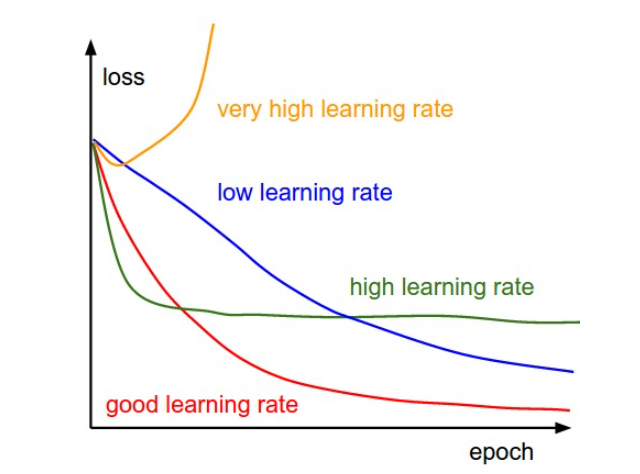

# 一般神经网络有哪些层？

* 卷积层

提取特征

* 激活层

对卷积层的输出结果做一次非线性映射，可以引入非线性因素，解决线性模型所不能解决的问题
 
常见的激励函数：sigmoid函数、tanh函数、ReLu函数、SoftMax函数、dropout函数等。

* 池化层

主要用于特征降维，压缩数据和参数量，减小过拟合

作用：下采样，降维，简化网络复杂度，减小计算量，减小内存消耗，扩大感受野

	如果输入的是图像，则池化层的主要作用就是压缩图像

池化层的具体作用：
	
	* 特征不变性：数据压缩只是去掉一些无关紧要的信息，留下的信息则是具有尺度不变性的特征；
	* 特征降维：去除无用重复的信息，只把重要的特征留下
	* 防止过拟合

* 全连接层

1、经过前面若干次卷积+激活+池化后，终于来到了全连接层（fully connected layers，FC）
     其实在全连接层之前，如果神经元数目过大，学习能力强，有可能出现过拟合。因此，可以引入dropout操作，来随机删除神经网络中的部分神经元，来解决此问题。

2、全连接层，在整个卷积神经网络中起到“分类器”的作用。

3、如果说卷积层、池化层和激活函数层等操作是将原始数据映射到隐层特征空间的话，全连接层则起到将学到的“分布式特征表示”映射到样本标记空间的作用。

# 过拟合和欠拟合

* 欠拟合

欠拟合是指模型不能在训练集上获得足够低的误差。换句换说，就是模型复杂度低，模型在训练集上就表现很差，没法学习到数据背后的规律。

解决办法：增加网络复杂度或者在模型中增加特征

* 过拟合

过拟合是模型在训练集上表现很好，但是在测试集上却表现很差，泛化能力差。

原因：训练数据集样本单一，样本不足
		 训练数据中噪声干扰过大
		 模型过于复杂

解决办法：

    * 使用正则化，正则化是指修改学习算法，使其降低泛化误差而非训练误差。

    * 获取和使用更多的数据（数据增强）----解决过拟合的根本性方法

    * 采用合适的模型（控制模型的复杂度）

    * 降低特征的数量

    * L1/L2正则化

### 学习率对训练的影响

这幅图表明了不同的学习率下，我们每轮完整迭代(这里的一轮完整迭代指的是所有的样本都被过了一遍，因为随机梯度下降中batch size的大小设定可能不同，因此我们不选每次mini-batch迭代为周期)过后的loss应该呈现的变化状况

当学习率比较大时（绿线），初始时强势下降，没过多久趋于平衡，解决办法是，后期学习率过大导致无法拟合，应减小学习率，并重新训练后面几轮。

全程下降缓慢（蓝线），解决办法是增大学习率，并从头开始训练