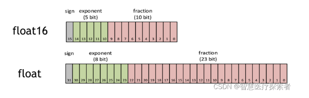

# Pytorch自动混合精度的计算：torch.cuda.amp.autocast

## 1.什么是AMP
2017年，NVIDIA研究了一种用于混合精度训练的方法，在网络训练的时候将单精度（FP32）与半精度（FP16）结合起来，并使用相同的超参数实现了与
FP32几乎相同的精度。



## 2.autocast

torch.cuda.amp.autocast 是pytorch中一种混合精度技术（仅在GPU上训练时可使用），可在保持数值精度的情况下提高训练速度和减少内存占用。

`    def __init__(self, enabled : bool = True, dtype : torch.dtype = torch.float16, cache_enabled : bool = True):`

它是一个自动类型转换器，可以根据输入数据的类型自动选择合适的精度进行计算，从而使得计算速度更快，同时也能够节省显存的使用。使用autocast可以避免在模型训练过程中手动进行类型转换，减少了代码实现的复杂性。

在深度学习中，通常会使用浮点数进行计算，但是浮点数需要占用更多的显存，而低精度数值可以在减少精度的同时，减少缓存使用量。
因此，对于正向传播和反向传播中的大多数计算，可以使用低精度型的数值，提高内存使用效率，进而提高模型的训练速度。

## 3 autocast原理

autocast的要做的事情，简单来说就是：在进入算子计算之前，选择性的对输入进行cast操作。为了做到这点，在PyTorch1.9版本的架构上，可以分解为如下两步：

* 在PyTorch算子调用栈上某一层插入处理函数
* 在处理函数中对算子的输入进行必要操作

PyTorch中的autocast功能是一个性能优化工具，它可以自动调整某些操作的数据类型以提高效率。
具体来说，它允许自动将数据类型从32位浮点（float32）转换为16位浮点（float16），这通常在使用深度学习模型进行训练时使用。

## 4 autocast优点

* 提高性能：使用16位浮点数（half precision）进行计算可以在支持的硬件上显著提高性能，特别是在最新的GPU上。

* 减少内存占用：16位浮点数占用的内存比32位少，这意味着在相同的内存限制下可以训练更大的模型或使用更大的批量大小。

* 自动管理：autocast能够自动管理何时使用16位浮点数，何时使用32位浮点数，这降低了手动管理数据类型的复杂性。

* 保持精度：尽管使用了较低的精度，但autocast通常能够维持足够的数值精度，对最终模型的准确度影响不大。

## 5 autocast缺点
* 硬件要求：并非所有的GPU都支持16位浮点数的高效运算。在不支持或优化不足的硬件上，使用autocast可能不会带来性能提升。

* 精度问题：虽然在大多数情况下精度损失不显著，但在某些应用中，尤其是涉及到小数值或非常大的数值范围时，降低精度可能会导致问题。

* 调试复杂性：由于autocast在模型的不同部分自动切换数据类型，这可能会在调试时增加额外的复杂性。

* 算法限制：某些特定的算法或操作可能不适合在16位精度下运行，或者在半精度下的实现可能还不成熟。

* 兼容性问题：某些PyTorch的特性或第三方库可能还不完全支持半精度运算。

在实际应用中，是否使用autocast通常取决于特定任务的需求、所使用的硬件以及对性能和精度的权衡。
通常，对于大多数现代深度学习应用，特别是在使用最新的GPU时，使用autocast可以带来显著的性能优势。

## 6 用例

with autocast(): 语句块内的代码会自动进行混合精度计算，也就是根据输入数据的类型自动选择合适的精度进行计算，
并且这里使用了GPU进行加速。使用示例如下：

```python
# 导入相关库
import torch
from torch.cuda.amp import autocast
 
# 定义一个模型
class MyModel(torch.nn.Module):
    def __init__(self):
        super(MyModel, self).__init__()
        self.linear = torch.nn.Linear(10, 1)
 
    def forward(self, x):
        with autocast():
            x = self.linear(x)
        return x
 
# 初始化数据和模型
x = torch.randn(1, 10).cuda()
model = MyModel().cuda()
 
# 进行前向传播
with autocast():
    output = model(x)
 
# 计算损失
loss = output.sum()
 
# 反向传播
loss.backward()
```
## 7 autocast与GradScaler一起使用

因为autocast会损失部分精度，从而导致梯度消失的问题，并且经过中间层时可能计算得到inf导致最终loss出现nan。所以我们通常将GradScaler与autocast配合使用来对梯度值进行一些放缩，来缓解上述的一些问题。

```
from torch.cuda.amp import autocast, GradScaler
 
dataloader = ...
model = Model.cuda(0)
optimizer = ...
scheduler = ...
scaler = GradScaler()  # 新建GradScale对象，用于放缩
for epoch_idx in range(epochs):
    for batch_idx, (dataset) in enumerate(dataloader):
        optimizer.zero_grad()
        dataset = dataset.cuda(0)
        with autocast():  # 自动混精度
            logits = model(dataset)
            loss = ...
        scaler.scale(loss).backward()  # scaler实现的反向误差传播
        scaler.step(optimizer)  # 优化器中的值也需要放缩
        scaler.update()  # 更新scaler
　　scheduler.step()
...
```

## 8 可能出现的问题

使用autocast技术进行混精度训练时loss经常会出现'nan'，有以下三种可能原因：

* 精度损失，有效位数减少，导致输出时数据末位的值被省去，最终出现nan的现象。该情况可以使用GradScaler（上文所示）来解决。
* 损失函数中使用了log等形式的函数，或是变量出现在了分母中，并且训练时，该数值变得非常小时，混精度可能会让该值更接近0或是等于0，
导致了数学上的log(0)或是x/0的情况出现，从而出现'inf'或'nan'的问题。这种时候需要针对该问题设置一个确定值。
例如：当log(x)出现-inf的时候，我们直接将输出中该位置的-inf设置为-100，即可解决这一问题。
* 模型内部存在的问题，比如模型过深，本身梯度回传时值已经非常小。这种问题难以解决。

