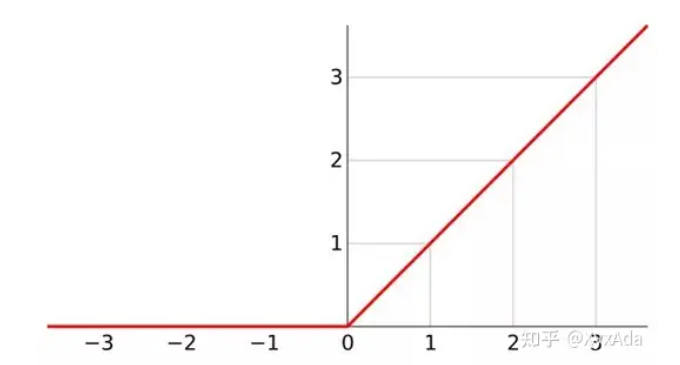

[参考资料--激活函数发展史](https://zhuanlan.zhihu.com/p/394465965)

ReLU (Recitified Linear Unit)线性整流函数又称为修正线性单元，是人工神经网络中最常用的激活函数。
在神经网络中，线性整流作为神经元的激活函数，定义了该神经元在线性变换之后的非线性输出结果。ReLU可以
对抗梯度爆炸/消失的问题，相对而言计算效率也很高，因为在2012年被著名的计算机视觉模型AlexNet应用，
ReLU变得流行起来，目前它被普遍认为是效果最好的激活函数。

首先需要说明的是，ReLU和Dropout都会返回一个神经元的输出，其中，ReLU会确定性的将输入乘上一个
0或者1，Dropout则是随机乘上0。而GELU也是通过将输入乘上0或1来实现这个功能，但是输入是乘以0
还是1，是在同时取决于输入自身分布的情况下随机选择的。换句话说，是0还是1取决于当前的输入有多大
的概率大于其余的输入。

GELU高斯误差线性单元激活函数

